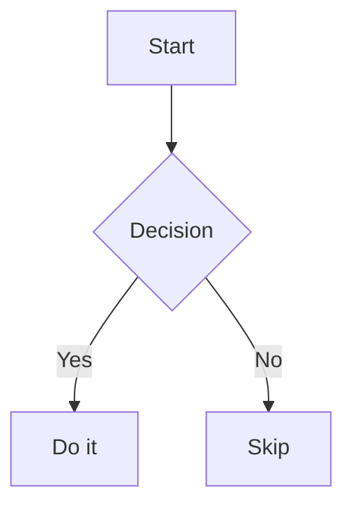

# Changelog

## [Unreleased] — Feature Release

This release adds 7 features to `md-viewer.py`: syntax highlighting, heading anchor links, Mermaid diagram rendering, emoji shortcodes, a light/dark theme switcher, custom CSS injection, and live content refresh.

---

### 1. Syntax Highlighting

Code blocks are highlighted via [highlight.js](https://highlightjs.org/) loaded from CDN. A custom `marked` renderer intercepts fenced code blocks and delegates to `hljs`.

**CDN setup:**
```html
<link id="hljs-dark-css" rel="stylesheet"
  href="https://cdn.jsdelivr.net/npm/highlight.js@11.10.0/styles/github-dark.min.css">
<link id="hljs-light-css" rel="stylesheet"
  href="https://cdn.jsdelivr.net/npm/highlight.js@11.10.0/styles/github.min.css" disabled>
<script src="https://cdn.jsdelivr.net/npm/highlight.js@11.10.0/highlight.min.js"></script>
```

**Custom renderer:**
```js
marked.use({
  renderer: {
    code({ text, lang }) {
      if (lang && hljs.getLanguage(lang)) {
        return '<pre><code class="hljs language-' + lang + '">'
          + hljs.highlight(text, { language: lang }).value
          + '</code></pre>';
      }
      return '<pre><code class="hljs">' + hljs.highlightAuto(text).value + '</code></pre>';
    }
  }
});
```

**Usage:** Fenced code blocks with a language tag are highlighted automatically.

````markdown
```python
def hello(name: str) -> str:
    return f"Hello, {name}!"
```
````

---

### 2. Heading Anchor Links

Each heading (`h1`–`h4`) gets a `#` link appended. The link is invisible by default and revealed on hover via CSS opacity.

**Implementation:**
```js
function addHeadingAnchors() {
  document.querySelectorAll('.md h1, .md h2, .md h3, .md h4').forEach(h => {
    if (h.querySelector('.heading-anchor')) return;
    const id = h.id || ('ha-' + Math.random().toString(36).slice(2));
    if (!h.id) h.id = id;
    const a = document.createElement('a');
    a.className = 'heading-anchor';
    a.href = '#' + id;
    a.textContent = '#';
    a.onclick = e => e.stopPropagation();
    h.appendChild(a);
  });
}
```

**CSS (hover reveal):**
```css
.heading-anchor {
  opacity: 0;
  margin-left: 0.4em;
  font-size: 0.75em;
  transition: opacity 0.15s;
  text-decoration: none;
}
.md h1:hover .heading-anchor,
.md h2:hover .heading-anchor,
.md h3:hover .heading-anchor,
.md h4:hover .heading-anchor { opacity: 1; }
```

**Usage:** Hover over any heading in a rendered document to reveal the `#` anchor. Click it to copy a direct link to that section.

---

### 3. Mermaid Diagram Support

[Mermaid.js](https://mermaid.js.org/) is loaded from CDN. The `marked` renderer converts ` ```mermaid ` fenced blocks into `<div class="mermaid">` elements, then `mermaid.run()` processes them asynchronously. Theme-aware: diagrams re-render when the theme switches.

**CDN setup:**
```html
<script src="https://cdn.jsdelivr.net/npm/mermaid@10/dist/mermaid.min.js"></script>
```

**Renderer + init:**
```js
// In the marked renderer:
if (lang === 'mermaid') {
  return '<div class="mermaid">' + text + '</div>';
}

// Mermaid init (theme-aware):
function initMermaid(theme) {
  mermaid.initialize({ startOnLoad: false, theme: theme === 'dark' ? 'dark' : 'default' });
}

async function runMermaid() {
  const nodes = document.querySelectorAll('.mermaid:not([data-processed])');
  if (nodes.length === 0) return;
  nodes.forEach(el => {
    if (!el.hasAttribute('data-mermaid-src')) el.setAttribute('data-mermaid-src', el.textContent);
  });
  try { await mermaid.run({ nodes }); } catch (e) {}
}
```

**Theme switching:** When the theme changes, `data-processed` is cleared and source text is restored from `data-mermaid-src`, allowing re-render with the new theme.

**Usage:**

````markdown

````

---

### 4. Emoji Shortcode Support

GitHub-style emoji shortcodes (e.g. `:rocket:`, `:fire:`) are replaced with Unicode emoji in rendered content. A `TreeWalker` walks text nodes, skipping `<code>` and `<pre>` blocks so code examples are never modified.

**Implementation:**
```js
const EMOJI_MAP = {
  'rocket': '🚀', 'fire': '🔥', 'tada': '🎉', 'bulb': '💡',
  'warning': '⚠️', 'white_check_mark': '✅', 'x': '❌',
  // ... ~50 shortcodes total
};

function applyEmojiShortcodes(el) {
  const walker = document.createTreeWalker(el, NodeFilter.SHOW_TEXT, {
    acceptNode: n =>
      n.parentElement.tagName === 'CODE' || n.parentElement.closest('pre')
        ? NodeFilter.FILTER_REJECT
        : NodeFilter.FILTER_ACCEPT
  });
  const nodes = [];
  while (walker.nextNode()) nodes.push(walker.currentNode);
  nodes.forEach(node => {
    const replaced = node.textContent.replace(
      /:([a-z0-9_+\-]+):/g,
      (m, name) => EMOJI_MAP[name] || m
    );
    if (replaced !== node.textContent) node.textContent = replaced;
  });
}
```

**Usage:** Write shortcodes directly in Markdown:

```markdown
Build complete :white_check_mark:

Deploy failed :x: — check logs :mag:

Shipped :rocket: :tada:
```

---

### 5. Light/Dark Theme Switcher

A toggle button in the toolbar switches between dark (default) and light themes. The preference is persisted in `localStorage`. CSS custom properties handle all color values, so a single `body.light` class switches the full palette. The highlight.js stylesheet pair is swapped simultaneously.

**Theme application:**
```js
let _currentTheme = localStorage.getItem('md-viewer-theme') || 'dark';

function applyTheme(theme) {
  _currentTheme = theme;
  document.body.classList.toggle('light', theme === 'light');
  const btn = document.getElementById('themeToggle');
  if (btn) btn.textContent = theme === 'dark' ? '☀️ Light' : '🌙 Dark';

  // Swap highlight.js stylesheets
  document.getElementById('hljs-dark-css').disabled = theme === 'light';
  document.getElementById('hljs-light-css').disabled = theme === 'dark';

  // Re-render Mermaid with new theme
  initMermaid(theme);
  document.querySelectorAll('.mermaid[data-processed]').forEach(el => {
    el.removeAttribute('data-processed');
    const src = el.getAttribute('data-mermaid-src');
    if (src) el.textContent = src;
  });
  runMermaid();

  localStorage.setItem('md-viewer-theme', theme);
}

function toggleTheme() { applyTheme(_currentTheme === 'dark' ? 'light' : 'dark'); }

// Restore on load
if (_currentTheme === 'light') applyTheme('light');
```

**CSS variables (light override):**
```css
body.light {
  --bg: #f5f6fa;
  --bg-surface: #ffffff;
  --bg-card: #ffffff;
  --border: #e2e4ed;
  --text: #1a1d2e;
  --text-muted: #5a5f7a;
  --text-heading: #0f1117;
}
```

**Usage:** Click "☀️ Light" / "🌙 Dark" in the top-right toolbar. Preference persists across page reloads and browser sessions.

---

### 6. Custom CSS Injection

Pass `--css <file>` on the CLI to inject a stylesheet into every rendered page. The HTML template contains a `__CUSTOM_CSS__` placeholder that Python replaces at serve time.

**CLI:**
```bash
python3 md-viewer.py --css my-styles.css
python3 md-viewer.py /docs --css brand.css 8080
```

**Argument parsing (Python):**
```python
CSS_FILE = None
_args = sys.argv[1:]
_i = 0
while _i < len(_args):
    if _args[_i] == '--css' and _i + 1 < len(_args):
        CSS_FILE = Path(_args[_i + 1])
        _i += 2
    else:
        _positional.append(_args[_i])
        _i += 1
```

**Template injection (Python):**
```python
def build_page():
    custom = ''
    if CSS_FILE and CSS_FILE.is_file():
        custom = CSS_FILE.read_text(encoding='utf-8', errors='replace')
    return HTML_TEMPLATE.replace('__CUSTOM_CSS__', custom, 1)
```

**Placeholder in template:**
```css
/* Inside <style> tag, at the end: */
__CUSTOM_CSS__
```

**Example `brand.css`:**
```css
:root { --accent: #e74c3c; }
.md h1 { border-bottom: 2px solid var(--accent); }
body { font-family: "Georgia", serif; }
```

---

### 7. Live Content Refresh

The file list is polled every 3 seconds via `fetch('/api/files')`. When the server returns a different set of paths (files added, deleted, or renamed), the sidebar re-renders automatically — no manual refresh needed.

**Implementation:**
```js
// Poll every 3 seconds for file list changes
setInterval(async () => {
  try {
    const resp = await fetch('/api/files');
    const data = await resp.json();
    const newPaths = data.files.map(f => f.path).join(',');
    const oldPaths = FILES.map(f => f.path).join(',');
    if (newPaths !== oldPaths) {
      FILES = data.files;
      renderNav();
      // Restore active highlight if still valid
      if (activeFileIdx !== null && activeFileIdx < FILES.length) {
        document.getElementById('nav-' + activeFileIdx)?.classList.add('active');
      }
    }
  } catch {}
}, 3000);
```

**Usage:** Start the viewer, then add, rename, or delete `.md` files in the served directory. The sidebar updates within 3 seconds without any browser refresh.

---

## Compatibility

All features work in any modern browser (Chrome, Firefox, Safari, Edge). No build step required — `md-viewer.py` is a single-file server with zero Python dependencies beyond the standard library. CDN resources require an internet connection; the viewer functions without them (syntax highlighting and Mermaid fall back gracefully).
