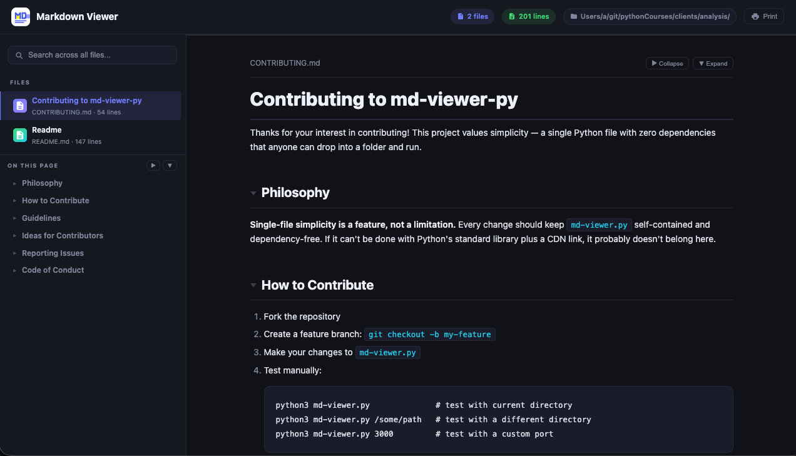

<p align="center">
  
</p>

<h1 align="center">md-viewer-py</h1>

<p align="center"><strong>Drop-in single-file Markdown viewer for any folder.</strong></p>

<p align="center">Zero dependencies. One file. Just run <code>mdview</code>.</p>

<p align="center">
  
</p>

---

## Features

- **Zero dependencies** — Python standard library only, nothing to install
- **Single file** — drop `md-viewer.py` into any folder and run
- **Dark theme UI** — polished dark interface, easy on the eyes
- **File tree sidebar** — folder navigation with collapsible directories
- **Full-text search** — search across all Markdown files instantly
- **Table of contents** — auto-generated with scroll spy and collapsible groups
- **Collapsible sections** — click any heading to collapse/expand its content
- **`.gitignore` support** — respects ignore patterns, skips `.git`, `node_modules`, etc.
- **Keyboard shortcuts** — arrow keys to navigate, `/` to search
- **Reading progress bar** — visual indicator of scroll position
- **Mobile responsive** — works on small screens with hamburger menu
- **Print-friendly** — clean print stylesheet for hard copies
- **Custom port and directory** — point it at any folder, pick any port
- **Live content refresh** — file list and content auto-refresh as files change

## Quick Start

Install once, use everywhere as `mdview`:

### macOS / Linux

```bash
curl -o ~/bin/md-viewer.py https://raw.githubusercontent.com/your-username/md-viewer-py/main/md-viewer.py
chmod +x ~/bin/md-viewer.py
```

Add an alias for your shell:

#### zsh

```bash
echo 'alias mdview="/full/path/to/md-viewer.py"' >> ~/.zshrc
source ~/.zshrc
```

#### bash

```bash
echo 'alias mdview="/full/path/to/md-viewer.py"' >> ~/.bashrc
source ~/.bashrc
```

### Windows

#### CMD

Create a `mdview.bat` file somewhere in your `PATH` (e.g. `C:\Users\<you>\bin\`):

```bat
@echo off
python "%~dp0md-viewer.py" %*
```

#### PowerShell

1. Open PowerShell and run:
   ```powershell
   notepad $PROFILE
   ```
2. Add this line to the opened file, save and close:
   ```powershell
   function mdview { python "C:\full\path\to\md-viewer.py" @args }
   ```
3. Back in PowerShell, run this to reload the profile:
   ```powershell
   . $PROFILE
   ```

### Usage

Once installed, use `mdview` from any directory:

```bash
mdview                        # serve current directory on port 8080
mdview 3000                   # custom port
mdview /path/to/docs          # custom directory
mdview /path/to/docs 3000     # both
mdview --css style.css        # inject custom CSS
```

A browser tab opens automatically at `http://localhost:8080`.

## Alternative: Copy and Run

No install needed — just drop the file into any folder:

```bash
# 1. Copy md-viewer.py into your project (or any folder with .md files)
# 2. Run it
python3 md-viewer.py
```

```bash
python3 md-viewer.py                     # serve current directory on port 8080
python3 md-viewer.py 3000                # custom port
python3 md-viewer.py /path/to/docs       # custom directory
python3 md-viewer.py /path/to/docs 3000  # both
python3 md-viewer.py --css style.css     # inject custom CSS
```

## Keyboard Shortcuts

| Key | Action |
|-----|--------|
| `/` or `Ctrl+K` | Focus search |
| `←` `↑` | Previous file |
| `→` `↓` | Next file |

## How It Works

`md-viewer.py` is a self-contained HTTP server built on Python's `http.server`. It scans the directory for `.md` files, serves a single-page dark-themed UI, and renders Markdown client-side using [marked.js](https://github.com/markedjs/marked) from a CDN. No build step, no config files, no virtual environments.

## Contributing

Contributions are welcome! See [CONTRIBUTING.md](CONTRIBUTING.md) for guidelines.

If you'd like to help but aren't sure where to start, here are some ideas:

- [x] Light theme / theme switcher
- [x] Syntax highlighting for code blocks (highlight.js)
- [x] Custom CSS injection via CLI flag
- [x] Mermaid diagram support
- [x] Emoji shortcode support
- [x] Anchor links on headings
- [x] Live reload on file changes
- [ ] Export to PDF or static HTML
- [ ] Plugin system for custom renderers
- [ ] Multi-language UI support

Feel free to [open an issue](../../issues) to discuss ideas before starting work.

## License

[MIT](LICENSE)
