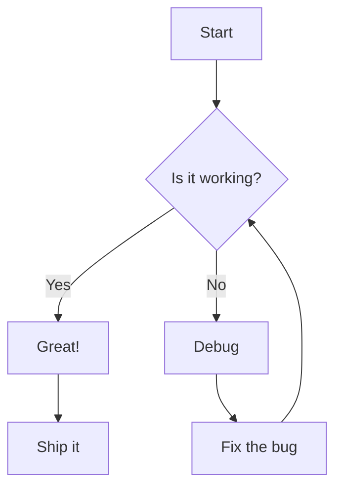
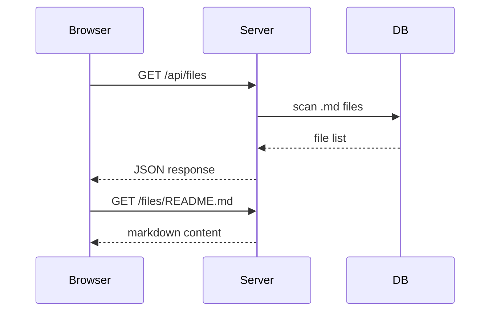
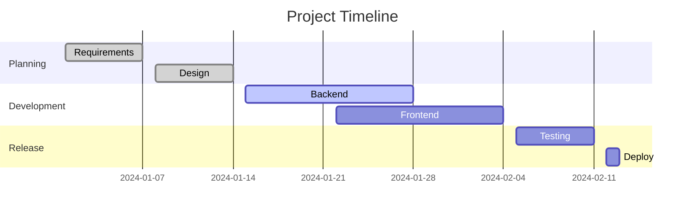
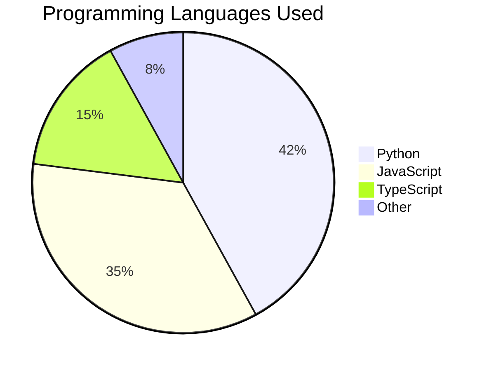
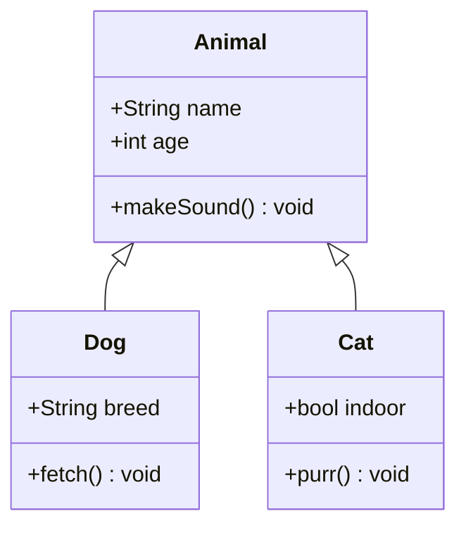
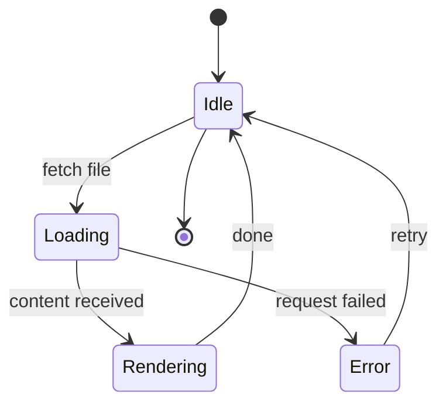
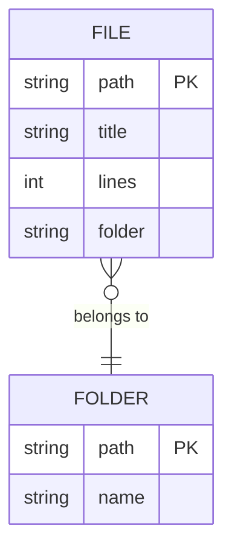

# Mermaid Diagram Examples

This file demonstrates Mermaid diagram support in the viewer.

## Flowchart

## Sequence Diagram

## Gantt Chart

## Pie Chart

## Class Diagram

## State Diagram

## Entity Relationship

